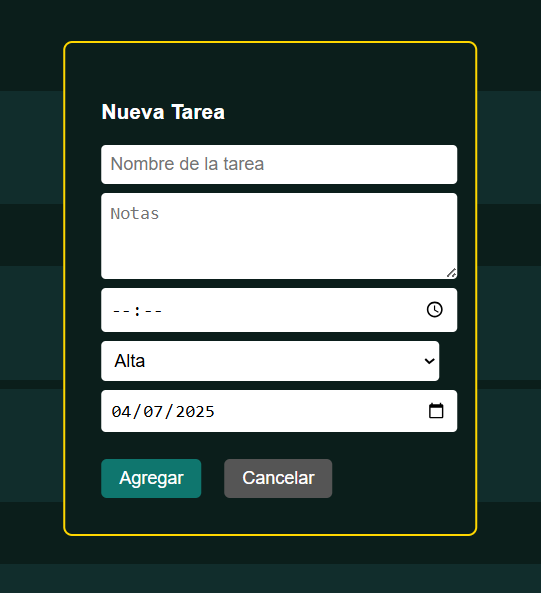
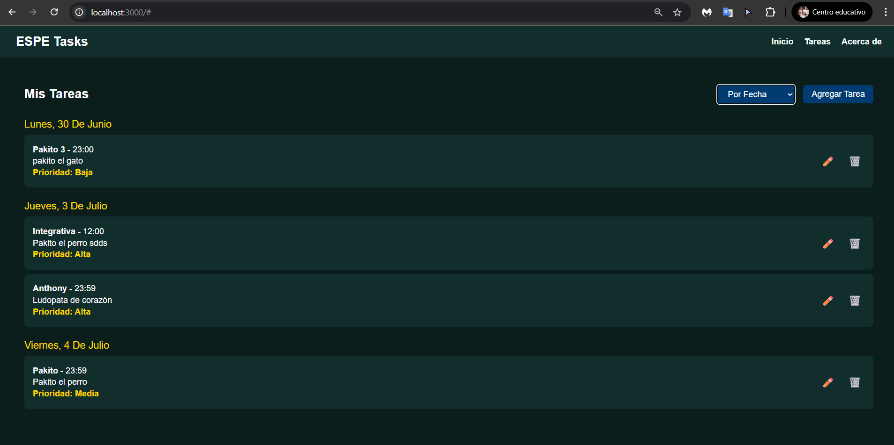
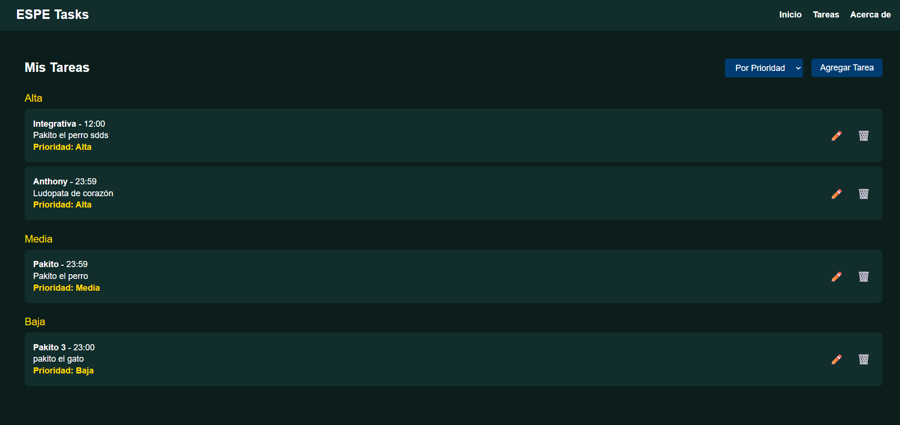

# ESPE Tasks – Gestor de Tareas con LitElement

Este Laboratorio es una aplicación web desarrollada con **LitElement** que permite gestionar tareas de forma modular y visual. Incluye funcionalidades para agregar, editar y eliminar tareas, así como visualizarlas agrupadas por **fecha** o por **prioridad**.

## Funcionalidades

Agregar tareas con:
  - Nombre
  - Hora
  - Notas
  - Prioridad (Alta, Media, Baja)
  - Fecha (seleccionable con calendario)
- Editar y eliminar tareas existentes
- Visualización de tareas agrupadas por:
  - Fecha (formato dinámico YYYY-MM-DD)
  - Prioridad
- Modal reutilizable para entrada de datos
- Estilos encapsulados con Shadow DOM

## Componentes

###  `<espe-task-list>`

- Componente principal
- Controla el estado global de las tareas
- Permite cambiar entre vista por fecha o prioridad
- Agrupa tareas dinámicamente

### `<espe-task-modal>`
- Modal para agregar o editar tareas
- Usa `<input type="date">` para seleccionar cualquier fecha
- Emite eventos personalizados: `task-added`, `modal-closed`

### `<espe-task-item>`
- Representa visualmente una tarea
- Muestra nombre, hora, notas y prioridad
- Emite eventos: `task-edit`, `task-deleted`

## Cómo ejecutarlo

1. Abre el proyecto en Visual Studio Code.
2. Usa Live Server o ejecuta un servidor local:

```bash
python -m http.server
```

## Eventos Personalizados

| Evento         | Emisor             | Descripción                                             |
|----------------|--------------------|---------------------------------------------------------|
| `task-added`   | `<espe-task-modal>`| Se dispara al guardar una tarea nueva o editada         |
| `task-edit`    | `<espe-task-item>` | Se dispara al hacer clic en el botón de editar          |
| `task-deleted` | `<espe-task-item>` | Se dispara al hacer clic en el botón de eliminar        |
| `modal-closed` | `<espe-task-modal>`| Se dispara al cerrar el modal sin guardar cambios       |

## Capturas de Pantalla

**Figura 1. Modal para Agregar una Nueva Tarea** 

  
Nota: Elaboración propia (2025). Muestra el formulario emergente con campos para nombre, notas, hora, prioridad y fecha.

**Figura 2. Vista de Tareas Agrupadas por Fecha**  

  
Nota: Elaboración propia (2025). Las tareas se agrupan dinámicamente por fechas reales seleccionadas con el calendario.

**Figura 3. Vista de Tareas Agrupadas por Prioridad**  

  
Nota: Elaboración propia (2025). Las tareas se organizan por nivel de prioridad: Alta, Media y Baja.

# Autor
- Anthony Mejia
- agmejia2@espe.edu.ec


